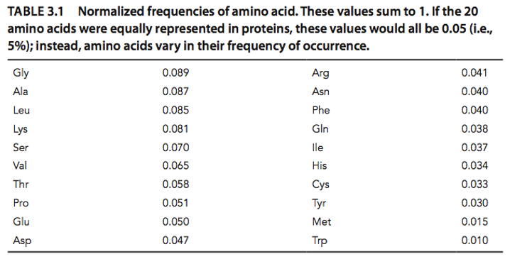

# hw1. generate PAM<sub>x</sub> matrix

## Description

* Writing Python program to generate PAM<sub>x</sub> from the given mutation probability matrix.
* PAM<sub>x</sub> must be as a log odds and complete square matrix (rounding to integer), not the format of the given mutation probability matrix.
* Creating your own program, ie. hw1.py, to read mut.txt and *x*, then output pamx.txt.

* You need to write your program as a function named generate_pam. ie.
```
def generate_pam(x, input_path, output_path):
    .
    .
    .
    .
```
* Upload your code 'hw1.py' to Gradescope and GitHub.
* packages you can use: numpy, pandas

* [HINT] PAM<sub>x</sub> is a symmetric matrix even though the given mutation probability matrix is not.
* [HINT] The mutation matrix should be divided by 10,000 before calculation PAM250. The value in the matrix should be in [0,1].
* Normalized frequencies of amino acids (<I>f<sub>i</sub></I>) credit by [Bioinformatics and Functional Genomics 3rd edition](https://www.wiley.com/en-us/Bioinformatics+and+Functional+Genomics,+3rd+Edition-p-9781118581780) 


## Parameters

* x: parameter of pam
* input_path: input file path
* output_path: output file path


## Files

* mut.txt: the input mutation probability matrix, M<sub>1</sub>
* pam250.txt: the output generated by generate_pam(250, 'example/mut.txt', 'example/pam250.txt'). The output format must be identical to the one of pam250.txt.


## Evaluation

There are 10 testing data (5 public, 5 private). 
* Correct answer gets 10 points for each testing data.


### Penalty

* High code similarity to others: YOUR SCORE = 0
